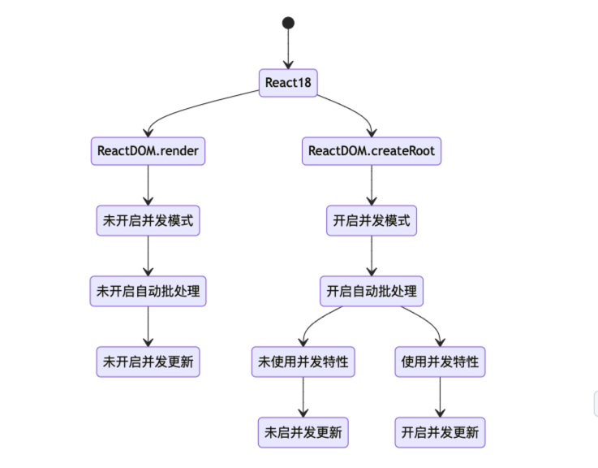
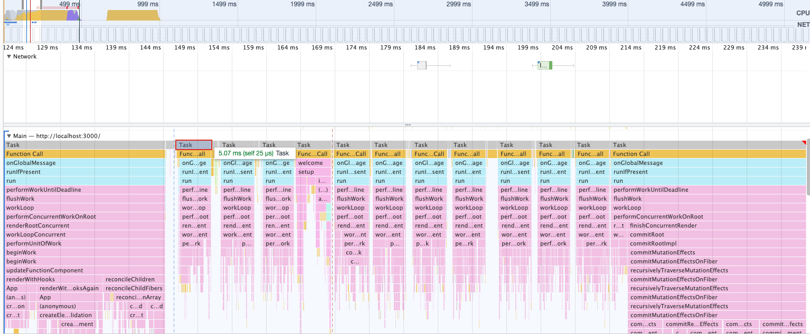

# React 18 的新特性

> 在 2022 年 3 月 29 日，`React 18` 正式版发布

## 新特性

### Render API

为了更好的管理 `root` 节点，`React 18` 引入了一个新的 `root API`，新的 `root API` 还支持 `new concurrent renderer`（并发模式的渲染）， 它允许你进入 `concurrent mode`（并发模式）

```tsx
/* React 17 */
import React from 'react'
import ReactDOM from 'react-dom'
import App from './App'

const root = document.getElementById('root')!

ReactDOM.render(<App />, root)

/* React 18 */
import React from 'react'
import ReactDOM from 'react-dom/client'
import App from './App'

const root = document.getElementById('root')!

ReactDOM.createRoot(root).render(<App />)
```

在卸载组件时，我们也需要将 `unmountComponentAtNode` 修改为 `root.unmount`

```ts
/* React 17 */
ReactDOM.unmountComponentAtNode(root)

/* React 18 */
root.unmount()
```

::: warning
如果在 `React 18` 中使用旧的 `render api`，在项目启动后会在控制台中输出一个警告：


这表示你可以将项目直接升级到 `React 18` 版本，而不会直接造成 **`break change`**。如果你需要保持着 `React 17` 版本的特性的话，那么你可以无视这个报错，因为它在整个 `18` 版本中都是兼容的
:::

`React 18` 还从 `render` 方法中删除了回调函数，因为在使用 `Suspense` 时，它通常不会有预期的结果

如果需要在 `render` 方法中使用回调函数，我们可以在组件中通过 `useEffect` 实现：

```tsx
/* React 17 */
const root = document.getElementById('root')
ReactDOM.render(<App />, root, () => {
  console.log('渲染完成')
})

/* React 18 */
const AppWithCallback: React.FC = () => {
  useEffect(() => {
    console.log('渲染完成')
  }, [])

  return <App />
}
const root = document.getElementById('root')
ReactDOM.createRoot(root).render(<AppWithCallback />)
```

如果在项目使用了 `ssr` 服务端渲染，需要把 `hydration` 升级为 `hydrateRoot`

```tsx
/* React 17 */
import ReactDOM from 'react-dom'
const root = document.getElementById('root')
ReactDOM.hydrate(<App />, root)

/* React 18 */
import ReactDOM from 'react-dom/client'
const root = document.getElementById('root')
ReactDOM.hydrateRoot(root, <App />)
```

如果在项目使用了 `TypeScript`，还需要更新 `TypeScript` 类型定义

在定义 `props` 类型时，如果需要获取子组件 `children`，那么你需要显式的定义它，例如这样：

```tsx
/* React 17 */
interface MyButtonProps {
  color: string
}

const MyButton: React.FC<MyButtonProps> = ({ children }) => {
  // 在 React 17 的 FC 中，默认携带了 children 属性
  return <div>{children}</div>
}

export default MyButton

/* React 18 */
interface MyButtonProps {
  color: string
  children?: React.ReactNode
}

const MyButton: React.FC<MyButtonProps> = ({ children }) => {
  // 在 React 18 的 FC 中，不存在 children 属性，需要手动申明
  return <div>{children}</div>
}

export default MyButton
```

### `Automatic Batching` 自动批处理

`React 18` 通过在默认情况下执行批处理来实现了开箱即用的性能改进

::: tip
批处理是指为了获得更好的性能，在数据层将多个状态更新批量处理，合并成一次更新（在视图层，将多个渲染合并成一次渲染）
:::

#### `React 18` 之前

在 `React 18` 之前，我们只在 `React` 事件处理函数 中进行批处理更新。默认情况下，在 `promise`、`setTimeout`、`原生事件处理函数`中、或`任何其它事件内`的更新都不会进行批处理

##### `React` 事件处理函数

```tsx
import React, { useState } from 'react'

// React 18 之前
const App: React.FC = () => {
  console.log('App组件渲染了！')
  const [count1, setCount1] = useState(0)
  const [count2, setCount2] = useState(0)
  return (
    <button
      onClick={() => {
        setCount1((count) => count + 1)
        setCount2((count) => count + 1)
        // 在React事件中被批处理
      }}
    >
      {`count1 is ${count1}, count2 is ${count2}`}
    </button>
  )
}

export default App
```


> 渲染次数和更新次数是一样的，即使我们更新了两个状态，每次更新组件也只渲染一次

##### `setTimeout`

```tsx
import React, { useState } from 'react'

// React 18 之前
const App: React.FC = () => {
  console.log('App组件渲染了！')
  const [count1, setCount1] = useState(0)
  const [count2, setCount2] = useState(0)
  return (
    <div
      onClick={() => {
        setTimeout(() => {
          setCount1((count) => count + 1)
          setCount2((count) => count + 1)
        })
        // 在 setTimeout 中不会进行批处理
      }}
    >
      <div>count1： {count1}</div>
      <div>count2： {count2}</div>
    </div>
  )
}

export default App
```


> 每次点击更新两个状态，组件都会渲染两次不会进行批量更新

##### 原生事件

```ts
import React, { useEffect, useState } from 'react'

// React 18 之前
const App: React.FC = () => {
  console.log('App组件渲染了！')
  const [count1, setCount1] = useState(0)
  const [count2, setCount2] = useState(0)
  useEffect(() => {
    document.body.addEventListener('click', () => {
      setCount1((count) => count + 1)
      setCount2((count) => count + 1)
    })
    // 在原生js事件中不会进行批处理
  }, [])
  return (
    <>
      <div>count1： {count1}</div>
      <div>count2： {count2}</div>
    </>
  )
}

export default App
```


> 每次点击会更新两个状态，组件都会渲染两次不会进行批量更新

#### `React 18` 发布后

在 `React 18` 发布后上面的三个例子只会 `render` 一次，因为所有的更新都将自动批处理（提高了应用的整体性能）

**不过以下例子会在 React 18 中执行两次 render**：

```tsx
import React, { useState } from 'react'

// React 18
const App: React.FC = () => {
  console.log('App组件渲染了！')
  const [count1, setCount1] = useState(0)
  const [count2, setCount2] = useState(0)
  return (
    <div
      onClick={async () => {
        await setCount1((count) => count + 1)
        setCount2((count) => count + 1)
      }}
    >
      <div>count1： {count1}</div>
      <div>count2： {count2}</div>
    </div>
  )
}

export default App
```

### `flushSync`

批处理是一个**破坏性改动**，如果想退出批量更新，可以使用 `flushSync`

```tsx
import React, { useState } from 'react'
import { flushSync } from 'react-dom'

const App: React.FC = () => {
  const [count1, setCount1] = useState(0)
  const [count2, setCount2] = useState(0)
  return (
    <div
      onClick={() => {
        flushSync(() => {
          setCount1((count) => count + 1)
        })
        // 第一次更新
        flushSync(() => {
          setCount2((count) => count + 1)
        })
        // 第二次更新
      }}
    >
      <div>count1： {count1}</div>
      <div>count2： {count2}</div>
    </div>
  )
}

export default App
```

::: warning
`flushSync` 函数内部的多个 `setState` 仍然为批量更新，这样可以精准控制哪些不需要的批量更新

有关**批处理**和 `flushSync` 的更多信息，你可以参阅 `React` 官方的 [Automatic batching deep dive（批处理深度分析）](https://github.com/reactwg/react-18/discussions/21)
:::

### 卸载组件时的更新状态警告

在开发时偶尔会遇到以下错误：


> 这个错误表示：**无法对未挂载（已卸载）的组件执行状态更新，这是一个无效操作，并且表明我们的代码中存在内存泄漏**

实际上，这个错误并不多见，在以往的版本中，这个警告被广泛误解，并且有些误导。这个错误的初衷是针对一些特殊场景，譬如 你在 `useEffect` 里面设置了定时器，或者订阅了某个事件，从而在组件内部产生了副作用，而且忘记 `return` 一个函数清除副作用，则会发生内存泄漏等之类的场景

但在实际开发中，更多的场景是我们在 `useEffect` 里面发送了一个异步请求，在异步函数还没有被 `resolve` 或者 `reject` 时，我们就卸载了组件。在这种场景中警告同样会触发。但是在这种情况下，组件内部并没有内存泄漏，因为这个异步函数已经被垃圾回收了，此时警告就存在误导性。关于这点 `React` 官方也有解释：

::: info Other Notable Changes
No warning about setState on unmounted components: Previously, React warned about memory leaks when you call setState on an unmounted component. This warning was added for subscriptions, but people primarily run into it in scenarios where setting state is fine, and workarounds make the code worse. We’ve removed this warning.

[Other Notable Changes](https://react.docschina.org/blog/2022/03/08/react-18-upgrade-guide#other-notable-changes)
:::

所以在 `React 18` 中，官方删除了这个报错（有关这个报错的更多信息，你可以[参阅 React 官方的说明](https://github.com/reactwg/react-18/discussions/82)）

### `React` 组件的返回值

- 在 `React 17` 中，如果你需要返回一个`空组件`，`React` 只允许返回`null`。如果你显式的返回了 `undefined`，控制台则会在运行时抛出一个错误。
- 在 `React 18` 中，不再检查因返回 `undefined` 而导致崩溃；即能返回 `null`，也可以返回 `undefined`（但是 `React 18` 的 `d.ts` 文件还是会检查，只允许返回 `null`，你可以忽略这个类型错误）

### `Strict Mode`

不再抑制控制台日志：

当你使用`严格模式`时，`React` 会对每个组件进行`两次渲染`，以便你观察一些意想不到的结果。在 `React 17` 中，取消了`其中一次渲染`的控制台日志，以便让日志更容易阅读。

为了解决社区对这个问题的困惑，在 `React 18` 中，官方取消了这个限制；如果你安装了`React DevTools`，第二次渲染的日志信息将显示为灰色，以柔和的方式显式在控制台。

[关于组件返回值的官方解释](https://github.com/reactwg/react-18/discussions/96)

### `Suspense` 不再需要 `fallback` 来捕获

`React 18` 在渲染 `Suspense` 组件时，对 `空的 fallback` 属性的处理做了改变：不再跳过 `缺失值` 或 `值为 null` 的 `fallback` 的 `Suspense` 边界。相反，会捕获边界并且向外层查找，如果查找不到将会把 `fallback` 呈现为 `null`

**`React 17`**：

如果 `Suspense` 组件没有提供 `fallback` 属性，`React` 就会悄悄跳过它，继续向上搜索下一个边界：

```tsx
const App: React.FC = () => {
  return (
    <Suspense fallback={<Loading />}>  // <--- 这个边界被使用，显示 Loading 组件
      <Suspense>                       // <--- 这个边界被跳过，没有 fallback 属性
        <Page />
      </Suspense>
    </Suspense>
  );
};

export default App;
```

`React` 工作组发现这可能会导致混乱、难以调试的情况发生。例如，你正在 `debug` 一个问题，并且在没有 `fallback` 属性的 `Suspense` 组件中抛出一个边界来测试一个问题，它可能会带来一些意想不到的结果，并且 `不会警告` 提示 `没有fallback` 属性

**`React 18`**：

`React 18` 将使用当前组件的 `Suspense` 作为边界，即使当前组件的 `Suspense` 的值为 `null` 或 `undefined`

```tsx
const App: React.FC = () => {
  return (
    <Suspense fallback={<Loading />}>  // <--- 不使用
      <Suspense>                       // <--- 这个边界被使用，将 fallback 渲染为 null
        <Page />
      </Suspense>
    </Suspense>
  );
};

export default App;
```

这个更新意味着我们`不再跨越边界组件`。相反我们将在边界处捕获并呈现 `fallback`，就像你提供了一个返回值为 `null` 的组件一样。这意味着被挂起的 `Suspense` 组件将按照预期结果去执行，如果忘记提供 `fallback` 属性也不会有什么问题

[关于 Suspense 的官方解释](https://github.com/reactwg/react-18/discussions/72)

## 新的 `API`

### `useId`

```tsx
const id = useId()
```

支持同一个组件在客户端和服务端生成相同的唯一 `ID`，避免 `hydration` 的不兼容，这解决了在 `React 18` 之前的版本中已经存在的问题。因为我们的服务器渲染时提供的 `HTML` 是`无序的`，`useId` 的原理就是每个 `id` 代表该组件在组件树中的层级结构

关于 `useId` 的更多信息，请参阅 [useId post in the working group](https://github.com/reactwg/react-18/discussions/111)

### `useSyncExternalStore`

`useSyncExternalStore` 是一个新的 `api`，其经历了一次修改，由 `useMutableSource` 修改而来，主要用来解决外部数据撕裂问题

`useSyncExternalStore` 一般是三方状态管理库使用，在日常业务中不需要关注。因为 `React` 自身的 `useState` 已经原生的解决的并发特性下的 `tear（撕裂）`问题。`useSyncExternalStore` 主要对于框架开发者，比如 `redux`，它在控制状态时可能并非直接使用的 `React` 的 `state`，而是自己在外部维护了一个 `store` 对象，用`发布订阅模式`实现了数据更新，脱离了 `React` 的管理，也就无法依靠 `React` 自动解决撕裂问题。因此 `React` 对外提供了这样一个 `API`。

目前 `React-Redux 8.0` 已经基于 `useSyncExternalStore` 实现。

关于 `useSyncExternalStore` 的更多信息，请参阅 [useSyncExternalStore overview post](https://github.com/reactwg/react-18/discussions/70) 和 [useSyncExternalStore API details](https://github.com/reactwg/react-18/discussions/86)

### `useInsertionEffect`

```tsx
const useCSS = (rule) => {
  useInsertionEffect(() => {
    if (!isInserted.has(rule)) {
      isInserted.add(rule)
      document.head.appendChild(getStyleForRule(rule))
    }
  })
  return rule
}

const App: React.FC = () => {
  const className = useCSS(rule)
  return <div className={className} />
}

export default App
```

这个 `Hooks` 只建议 `css-in-js` 库来使用。 这个 `Hooks` 执行时机在 `DOM` 生成之后，`useLayoutEffect` 之前，它的工作原理大致和 `useLayoutEffect` 相同，只是此时无法访问 `DOM` 节点的引用，一般用于提前注入 `<style>` 脚本

关于 `useInsertionEffect` 的更多信息，请参阅 [Library Upgrade Guide for `<style>`](https://github.com/reactwg/react-18/discussions/110)

## `Concurrent Mode` 并发模式

`Concurrent Mode`（以下简称 `CM`）翻译叫并发模式，这个概念我们或许已经听过很多次了，实际上在去年这个概念已经很成熟了，在 `React 17` 中就可以通过一些`试验性`的 `api` 来开启 `CM`

`CM` 本身并不是一个功能，而是一个底层设计，它可以帮助应用保持响应，并根据用户的设备性能和网速进行适当的调整，该模式通过使渲染可中断来修复`阻塞渲染`限制。在并发模式中 `React` 可以同时更新多个状态

::: tip
`React 17` 和 `React 18` 的区别就是：**从同步不可中断更新变成了异步可中断更新**
:::

### 开启并发模式就是开启并发更新吗？

> 在 `React 18` 中，提供了新的 `root api`，我们只需要把 `render` 升级成 `createRoot(root).render(<App />)` 就可以开启并发模式

在 `React 17` 的一些实验性功能里面，开启`并发模式`就是开启`并发更新`，但在 `React 18` 正式版发布后，由于官方策略调整 `React` 不再依赖并发模式开启并发更新，即开启`并发模式`并不一定开启了`并发更新`

::: tip
**在 `18` 中不再有多种模式，而是以`是否使用并发特性`作为`是否开启并发更新`的依据**
:::

从最老的版本到当前的 `v18`，市面上有多少个版本的`React`？

可以从架构角度来概括下，当前一共有两种架构：

- 采用不可中断的`递归`方式更新的`Stack Reconciler`（老架构）
- 采用可中断的`遍历`方式更新的`Fiber Reconciler`（新架构）

新架构可以选择是否开启`并发更新`，所以当前市面上所有 `React` 版本有四种情况：

1. 老架构（v15 及之前版本）
2. 新架构，未开启并发更新，与情况 1 行为一致（v16、v17 默认属于这种情况）
3. 新架构，未开启并发更新，但启用了并发模式和一些新功能（比如 `Automatic Batching`，v18 默认属于这种情况）
4. 新架构，开启并发模式，开启并发更新

`并发特性`指开启`并发模式`后才能使用的特性，比如：

- `useDeferredValue`
- `useTransition`



### 并发特性

<br />

#### `startTransition`

在 `React 18` 中运行如下代码：

```tsx
import React, { useState, useEffect, useTransition } from 'react'

const App: React.FC = () => {
  const [list, setList] = useState<any[]>([])
  const [isPending, startTransition] = useTransition()
  useEffect(() => {
    // 使用了并发特性，开启并发更新
    startTransition(() => {
      setList(new Array(10000).fill(null))
    })
  }, [])
  return (
    <>
      {list.map((_, i) => (
        <div key={i}>{i}</div>
      ))}
    </>
  )
}

export default App
```

由于 `setList` 在 `startTransition` 的回调函数中执行（使用`并发特性`），所以 `setList` 会触发`并发更新`

`startTransition` 主要为了能在大量的任务下也能保持 `UI` 响应。这个 `API` 可以通过将特定更新标记为`“过渡”`来显著改善用户交互，即被 `startTransition` 回调包裹的 `setState` 触发的渲染被标记为不紧急渲染，这些渲染可能被其他`紧急渲染`所抢占

- 关于 `startTransition` 的更多信息，请参阅 [Patterns for startTransition](https://github.com/reactwg/react-18/discussions/100)

#### `useDeferredValue`

`useDeferredValue` 会返回一个延迟响应的值，即让一个 `state` 延迟生效（只有当前没有紧急更新时该值才会变为最新值）。`useDeferredValue` 和 `startTransition` 一样都是标记了一次非紧急更新

::: tip `useDeferredValue` 与 `useTransition`

- 相同：`useDeferredValue` 本质上和内部实现与 `useTransition` 一样，都是标记成了`延迟更新`任务。
- 不同：`useTransition` 是把更新任务变成了延迟更新任务，而 `useDeferredValue` 是产生一个新的值，这个值作为延时状态。（一个用来包装方法，一个用来包装值）

:::

> 使用 `useDeferredValue` 改写上面的 🌰

```tsx
import React, { useState, useEffect, useDeferredValue } from 'react'

const App: React.FC = () => {
  const [list, setList] = useState<any[]>([])
  useEffect(() => {
    setList(new Array(10000).fill(null))
  }, [])
  // 使用了并发特性，开启并发更新
  const deferredList = useDeferredValue(list)
  return (
    <>
      {deferredList.map((_, i) => (
        <div key={i}>{i}</div>
      ))}
    </>
  )
}

export default App
```

> 执行堆栈图



从执行堆栈图看到，任务被拆分到每一帧不同的 `task` 中，`JavaScript` 执行时间大体在`5ms`左右，这样浏览器就有剩余时间执行**样式布局**和**样式绘制**，减少掉帧的可能性

关于 useDeferredValue 的更多信息，请参阅 [New in 18: useDeferredValue](https://github.com/reactwg/react-18/discussions/129)

#### 普通情况

> 关闭并发特性在普通情况中运行项目

```tsx
import React, { useState, useEffect } from 'react'

const App: React.FC = () => {
  const [list, setList] = useState<any[]>([])
  useEffect(() => {
    setList(new Array(10000).fill(null))
  }, [])
  return (
    <>
      {list.map((_, i) => (
        <div key={i}>{i}</div>
      ))}
    </>
  )
}

export default App
```


从执行堆栈图看到，由于组件数量繁多（10000 个），`JavaScript` 执行时间为 `300ms`，也就是意味着在没有并发特性的情况下：一次性渲染 `10000` 个标签的时候，页面会阻塞大约 `0.3` 秒，造成卡顿；但是如果开启并发更新就不会存在这样的问题

::: tip 并发模式总结

- 并发更新的意义就是`交替执行`不同的任务，当预留的时间不够用时，`React` 将线程控制权交还给浏览器，等待下一帧时间到来，然后继续被中断的工作
- `并发模式`是实现`并发更新`的基本前提
- `时间切片`是实现`并发更新`的具体手段

:::

::: tip `fiber` 的含义

1. `架构`角度：在旧的架构中，`Reconciler（协调器）`采用递归的方式执行，无法中断，节点数据保存在递归的调用栈中，被称为 `Stack Reconciler`，stack 就是调用栈；在新的架构中，`Reconciler（协调器）`是基于 `fiber` 实现的，节点数据保存在 `fiber` 中，所以被称为 `fiber Reconciler`
2. 静态`数据结构`角度：每个 `fiber` 对应一个组件，保存了这个组件类型对应的 `dom` 节点信息，这时，`fiber` 节点就是我们所说的`虚拟DOM`
3. 动态`工作单元`角度：`fiber` 节点保存了该节点需要更新的状态以及需要执行的副作用

:::

**相关文章**:

- [React18 新特性解读 & 完整版升级指南](https://github.com/li-jia-nan/How-to-Upgrade-to-React18)
