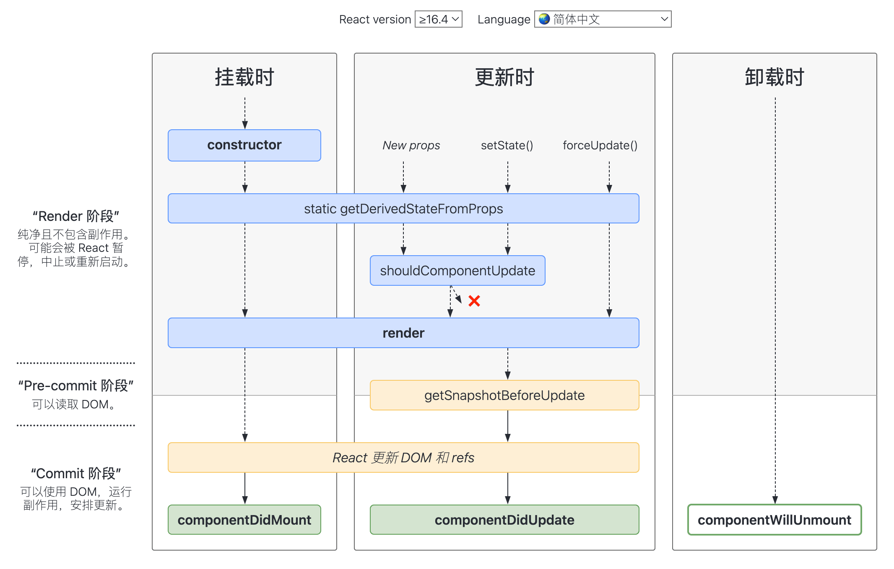

# React 常见面试题

::: tip 一些相关资料

- [React 官方文档](https://zh-hans.reactjs.org/)
- [旧版 React 官方文档](https://zh-hans.legacy.reactjs.org)
- [深入浅出搞定 React | 拉钩教育](https://kaiwu.lagou.com/course/courseInfo.htm?courseId=510)
- [前端面试宝典之 React 篇 | 拉钩教育](https://kaiwu.lagou.com/course/courseInfo.htm?courseId=566)

:::

## `JSX` 语法

`JSX` 是一个 `JavaScript` 的语法扩展，结构类似 `XML`

### 为什么要使用 `JSX`

> `JSX` 是 `React` 的一大特性

使用 `JSX` 可以让我们在 `JavaScript` 中编写类似 `HTML` 的代码，这样做的好处是可以让我们在 `JavaScript` 中直接使用 `HTML` 标签，而不用通过 `document.createElement` 等方法来创建元素，这样可以让我们的代码更加简洁，更加直观

### JSX 语法的本质

在 `React` 中所有的元素都是通过 `React.createElement` 方法创建的。使用 `JSX` 语法的代码最终会被 `Babel` 编译为 `React.createElement` 方法，即 **`JSX` 语法的本质就是 `React.createElement` 方法**

```jsx
// JSX 语法
import React from 'react'
const element = <h1 className="greeting">Hello, world!</h1>

// 通过 babel 转化为 React.createElement 方法
import React from 'react'
const element = React.createElement('h1', { className: 'greeting' }, 'Hello, world!')
```

这也是为什么在 `React 17` 之前我们在使用 `JSX` 语法时必须要引入 `React` 的原因，如果不引入 `React` 就会因为找不到 `React.createElement` 方法导致编译失败

::: tip 全新的 JSX 转换
`React 17` 提供了[全新的 JSX 转换](https://zh-hans.legacy.reactjs.org/blog/2020/09/22/introducing-the-new-jsx-transform.html)，在使用时不再需要引入 `React`

```jsx
// 源代码
function App() {
  return <h1>Hello World</h1>
}

// 新的 JSX 转换
import { jsx as _jsx } from 'react/jsx-runtime'

function App() {
  return _jsx('h1', { children: 'Hello world' })
}
```

:::

### `JSX` 和 `HTML` 的区别

`JSX` 和 `HTML` 有以下几点区别：

- `JSX` 中的标签名使用驼峰命名法，而 `HTML` 中的标签名使用小写字母命名法；
- `JSX` 中的标签属性名使用驼峰命名法，而 `HTML` 中的标签属性名使用小写字母命名法；
- `JSX` 中的标签属性值可以是字符串也可以是表达式，而 `HTML` 中的标签属性值只能是字符串；
- `JSX` 中的标签可以自定义，而 `HTML` 中的标签必须是 `HTML` 规定的标签。

### 为什么使用自定义组件必须以大写字母开头

在 `JSX` 中，如果标签名以小写字母开头，那么它会被当作一个字符串而不是一个组件来处理，而如果标签名以大写字母开头，那么它会被当作一个组件来处理。这是因为在 `JSX` 中，`React` 会将以小写字母开头的标签名视为 `HTML` 原生标签，而将以大写字母开头的标签名视为自定义组件。为了避免混淆，`React` 自定义组件的标签名必须以大写字母开头

```jsx
/* 使用原生标签 */
<app>maomao</app>
// 等价于
React.createElement('app', null, 'maomao')

/* 使用自定义组件 */
<App>maomao</App>
// 等价于
React.createElement(App, null, 'maomao')
```

## 数据在 `React` 组件中的流动

`React` 是数据驱动视图，即视图会随着数据的变化而变化

### 单向数据流

**`React` 是基于 `props` 的单向数据流**，指**当前组件的 `state` 以 `props` 的形式流动时，只能流向组件树中比自己层级更低的组件**，即流动是单向的，只能从父组件流向子组件，而不能从子组件流向父组件

### `state` 和 `props` 的区别

> `state` 和 `props` 都是组件的数据来源，但它们有以下区别：

- `state` 是可变的，是组件内部维护的一组用于反映组件 UI 变化的状态集合
- `props` 是组件的只读属性，组件内部不能直接修改，只能通过外部传入新的 `props` 来更新组件

即：**`state` 是组件对内的接口，`props` 是组件对外的接口**

### 组件通信

在 `React` 中，组件之间的通信主要有以下几种：

- 父组件向子组件通信
- 子组件向父组件通信
- 兄弟组件通信
- 父组件向后代组件通信
- 无关组件通信

#### 父组件向子组件通信

利用 `React` 单向数据流通过 `props` 进行传递通信

```jsx
// 子组件
function Child(props) {
  return <div>{props.name}</div>
}

// 父组件
function Parent() {
  return <Child name="maomao" />
}
```

#### 子组件向父组件通信

通过 `props` 传递回调函数进行通信

> 子组件通过调用父组件传递过来的回调函数来向父组件通信

```jsx
// 子组件
function Child(props) {
  return <button onClick={() => props.onClick('我是子组件的数据')}>传递数据给父组件</button>
}

// 父组件
function Parent() {
  const handleClick = (data) => {
    console.log(data) // 点击后会输出：我是子组件的数据
  }

  return <Child onClick={handleClick} />
}
```

#### 兄弟组件通信

通过父组件中转数据的方式进行通信，即**兄弟组件之间的通信需要将数据提升到它们的共同父组件中进行管理**

`兄弟 1 → 兄弟 2` 会变成 `兄弟 1 → 父组件`（子父通信）和 `父组件 → 兄弟 2`（父子通信）

```jsx
// 兄弟组件
function Brother1(props) {
  return <div>{props.name}</div>
}

function Brother2(props) {
  return <button onClick={() => props.onClick('茂茂')}>传递数据给兄弟组件</button>
}

// 父组件
function Parent() {
  const [name, setName] = useState('maomao')

  const handleClick = (data) => {
    setName(data)
  }

  return (
    <>
      <Brother1 name={name} />
      <Brother2 onClick={handleClick} />
    </>
  )
}
```

#### 父组件向后代组件通信和无关组件通信

> 父组件向后代组件通信不使用 `props` 传递数据，当层层传递 props 时会造成组件之间的耦合，不利于组件的复用，而且会造成组件之间的数据流动不可控

常见的解决方案有以下几种：

- 使用 `React` 的 `Context` 进行通信
- 使用发布订阅模式进行通信
  - [event-emitter](https://github.com/medikoo/event-emitter)
  - [mitt](https://github.com/developit/mitt)
  - [eventbus](
- 使用第三方状态管理库进行通信
  - [Zustand](https://docs.pmnd.rs/zustand/getting-started/introduction)
  - [Redux](https://cn.redux.js.org)
  - [Mobx](https://zh.mobx.js.org)

**使用 `React` 的 `Context` 进行通信**

```jsx
// 创建 Context
const Context = React.createContext()

// 子组件
function Child() {
  const { name } = useContext(Context)

  return <div>{name}</div>
}

// 父组件
function Parent() {
  return (
    <Context.Provider value={{ name: 'maomao' }}>
      <Child />
    </Context.Provider>
  )
}
```

更多关于 `Context` 的内容请参考：[使用 Context 深层传递参数 | React](https://zh-hans.react.dev/learn/passing-data-deeply-with-context)

## 组件的生命周期

> 只有类组件才有生命周期，函数组件没有生命周期

::: tip `getDerivedStateFromProps` 方法

- 用于 `props` 到 `state` 的映射
- 设计成静态方法的是为了阻止开发者在其内部使用 `this`，从而防止错误的使用 `this.setState`

:::

### React 16.3 的生命周期


在 `React 16.3` 版本时只有父组件的更新会触发 `static getDerivedStateFromProps`

### React 16.4 之后的生命周期



- 挂载阶段
  - `constructor`：初始化 `state` 和 `props`
  - `static getDerivedStateFromProps`：根据 `props` 初始化 `state`
  - `render`：渲染组件
  - `componentDidMount`：组件挂载完成
- 更新阶段
  - `static getDerivedStateFromProps`：根据 `props` 更新 `state`
  - `shouldComponentUpdate`：控制组件是否更新
  - `render`：渲染组件
  - `getSnapshotBeforeUpdate`：在组件更新前获取 DOM 信息
  - `componentDidUpdate`：组件更新完成
- 卸载阶段
  - `componentWillUnmount`：组件卸载前

在 React 16.4 之后，任何因素触发的组件更新流程（包括 `this.setState` 和 `forceUpdate` 触发的更新流程）都会触发 `static getDerivedStateFromProps`

**相关资料**：

- [你可能不需要使用派生 state](https://zh-hans.legacy.reactjs.org/blog/2018/06/07/you-probably-dont-need-derived-state.html)
- [React lifecycle methods diagram](https://projects.wojtekmaj.pl/react-lifecycle-methods-diagram/)
