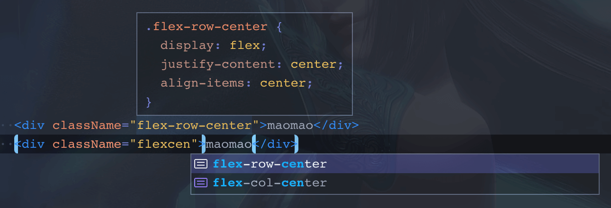

# Tailwind CSS 使用与配置

- [Tailwind CSS 中文文档](https://www.tailwindcss.cn/docs)
- [Tailwind CSS 英文文档](https://tailwindcss.com/docs/installation)
- [Tailwind CSS | Github](https://github.com/tailwindlabs/tailwindcss)
- [awesome-tailwindcss](https://github.com/aniftyco/awesome-tailwindcss)

## 安装与使用

- `tailwindcss` 3.x

```sh
# 安装依赖
pnpm add -D tailwindcss@latest postcss@latest autoprefixer@latest

# 生成配置文件
npx tailwindcss init -p
```

## 基础配置

开启 `jit` 模式

> `tailwind.config.cjs` or `tailwind.config.js`

```js
/** @type {import('tailwindcss').Config} */
module.exports = {
  mode: 'jit',
  content: ['./index.html', './src/**/*.{js,jsx,ts,tsx,vue}'],
  theme: {
    extend: {}
  },
  plugins: []
}
```

## 常用技巧

### 在自定义样式中使用 `tailwindcss` 的变量

Tailwind CSS 提供了 `theme()` 函数，可以让我们在自定义样式中使用 `tailwindcss` 的变量

> 使用 `theme()` 函数

```css
.content {
  height: calc(100vh - theme('spacing.10'));
  background-color: theme('colors.blue.400');
}
```

::: warning 关于 `theme()` 函数的参数

- 可以使用 `.` 进行嵌套
- 最好使用引号包裹，否则在 `VSCode` 中会出现 `Intellisense` 智能提示错误

:::

> 编译结果

```css
.content {
  height: calc(100vh - 2.5rem);
  background-color: #60a5fa;
}
```

::: tip 使用 `theme()` 函数的优点

- 可以使用 `tailwindcss` 的变量
- 统一管理样式（当需要修改主题配置时，方便进行统一调整）

:::

[使用 theme() 函数 | Tailwind CSS 文档](https://tailwindcss.com/docs/functions-and-directives#theme)

### 优先使用插件注入样式的方式

::: tip
优先使用插件注入的方式，而不是直接定义样式，这样可以在 `VSCode` 中使用 `tailwindcss` 的 `Intellisense` 功能（智能提示）
:::

使用 `layer` 直接定义的样式，在 `VSCode` 中没有智能提示

```css
@layer utilities {
  .flex-row-center {
    @apply flex justify-center items-center;
  }
  .flex-col-center {
    @apply flex-row-center flex-col;
  }
}
```

使用插件注入的样式，**在 `VSCode` 中可以使用 `tailwindcss` 的 `Intellisense` 功能（智能提示）**



## 常用插件

### `line-clamp`

`line-clamp` 用于限制文本的行数并显示省略号

> tailwindcss v3.3 开始默认包含 `line-clamp` 插件

**安装**：

```sh
pnpm add -D @tailwindcss/line-clamp
```

**修改 `tailwind.config.cjs`**：

```js
module.exports = {
  // ...其他配置
  plugins: [
    // ...其他插件
    require('@tailwindcss/line-clamp')
  ]
}
```

**使用**：

- 使用 `line-clamp-{n}` 指定行数（`n` 默认最大为 `6`）
- 使用 `line-clamp-none` 取消行数限制

```html
<p class="line-clamp-1">知识是进步的阶梯，争取每天都有知识点更新</p>
```

- [@tailwindcss/line-clamp | GitHub](https://github.com/tailwindlabs/tailwindcss-line-clamp)

### `forms`

`forms` 用于快速生成表单样式

**安装**：

```sh
pnpm add -D @tailwindcss/forms
```

**修改 `tailwind.config.cjs`**：

```js
module.exports = {
  // ...其他配置
  plugins: [
    // ...其他插件
    require('@tailwindcss/forms')
  ]
}
```

**使用**：

- 使用 `form-{name}` 添加样式

```html
<input type="email" class="form-input px-4 py-3 rounded-full" />
<input type="checkbox" class="form-checkbox rounded text-pink-500" />
```

[@tailwindcss/forms | GitHub](https://github.com/tailwindlabs/tailwindcss-forms)

## 个人常用配置

```js
const plugin = require('tailwindcss/plugin')

const flexCenterBaseStyles = {
  display: 'flex',
  'justify-content': 'center',
  'align-items': 'center'
}

module.exports = {
  mode: 'jit',
  content: ['./index.html', './src/**/*.{js,jsx,ts,tsx,vue}'],
  theme: {
    extend: {}
  },
  plugins: [
    /* flex 居中 */
    plugin(function ({ addUtilities }) {
      addUtilities({
        '.flex-row-center': flexCenterBaseStyles,
        '.flex-col-center': { ...flexCenterBaseStyles, 'flex-direction': 'column' }
      })
    })
  ]
}
```

::: tip

为了方便使用，已发布到 [npm](https://www.npmjs.com/package/@femm/tailwind-config)

> 安装依赖

```sh
pnpm add -D @femm/tailwind-config
```

> 创建 `tailwind.config.cjs` 文件（内容如下）

```js
/** @type {import('tailwindcss').Config} */
module.exports = {
  presets: [require('@femm/tailwind-config')]
}
```

:::

- [Presets | Tailwind CSS 文档](https://tailwindcss.com/docs/presets)
- [@femm/tailwind-config | GitHub](https://github.com/maomao1996/femm/tree/main/packages/tailwind-config)

## 如何测试 `tailwindcss` 的样式

- 使用 [Tailwind CSS Play](https://play.tailwindcss.com)
- [使用 `jest` 进行测试](#使用-jest-进行测试)

### 使用 `jest` 进行测试

> 安装依赖

```sh
pnpm add -D jest postcss tailwindcss
# 配置脚本
npm pkg set scripts.test='jest'
```

::: warning
如果被 `jest` 缓存坑了（比如我），可以改成 `jest && jest --clearCache` 清除缓存
:::

> 创建测试文件 `tailwindcss.test.js`

```js {4,19-20}
const postcss = require('postcss')

it('tailwindcss presets config', () => {
  /* 编译出来的缩进是 4 空格 */
  const expected = `
.z-\\[1996\\] {
    z-index: 1996
}
.flex {
    display: flex
}
`
  postcss([
    require('tailwindcss')({
      content: [{ raw: `flex z-[1996]` }],
      presets: [require('../lib/index')]
    })
  ])
    /* @tailwind utilities 是 tailwindcss 的语法 */
    .process('@tailwind utilities', { from: undefined })
    .then(({ css }) => {
      expect(css).toBe(expected.trim())
    })
})
```

> 运行测试

```sh
pnpm test
```

- [@femm/tailwind-config/tests | GitHub](https://github.com/maomao1996/femm/tree/main/packages/tailwind-config/tests)
